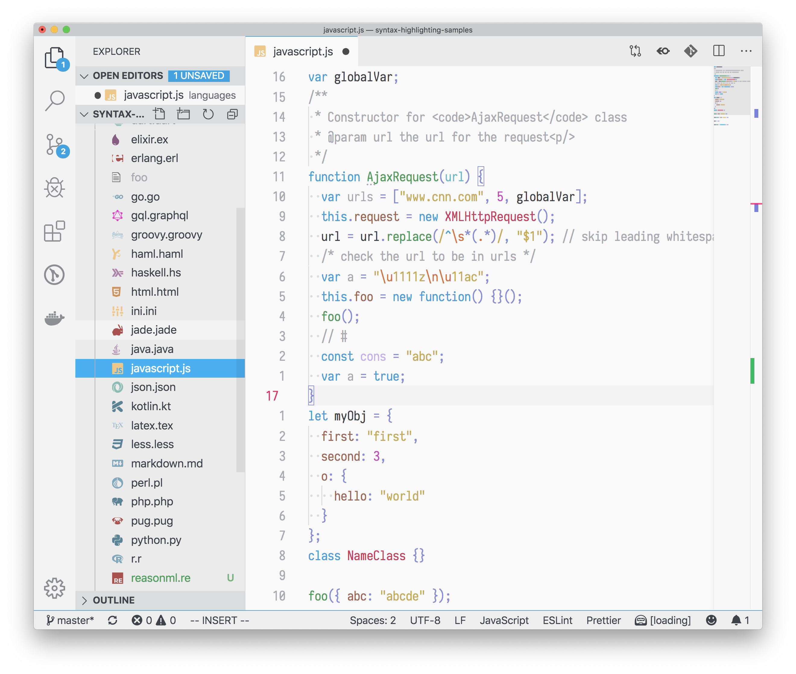
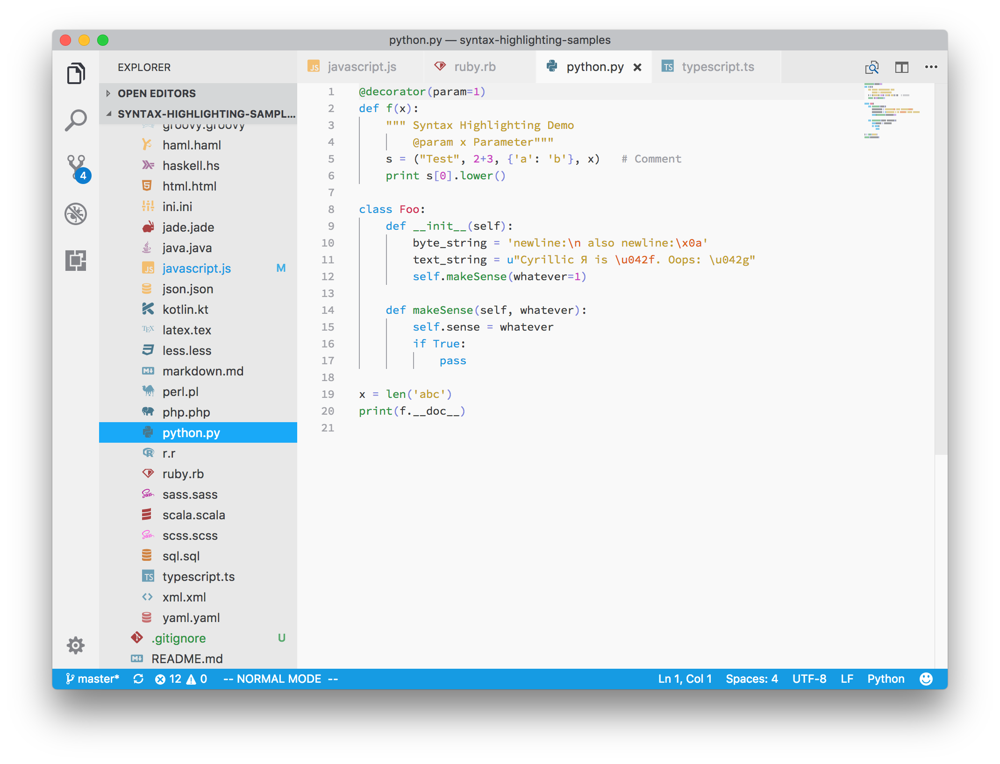
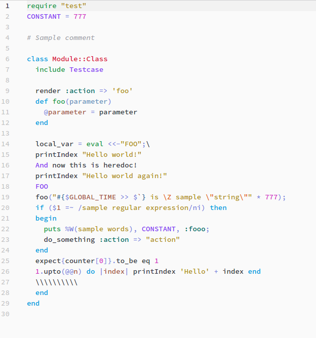
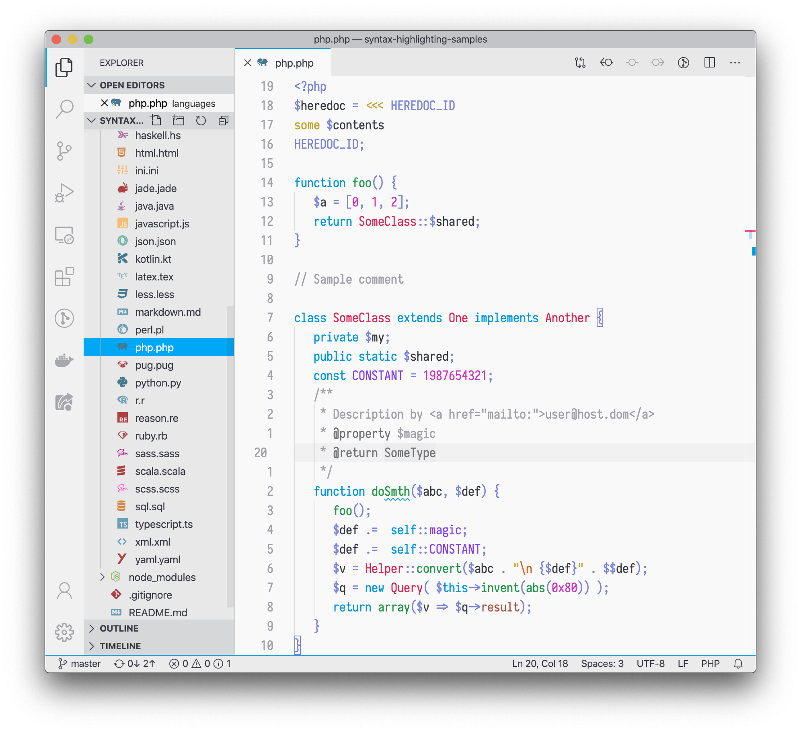
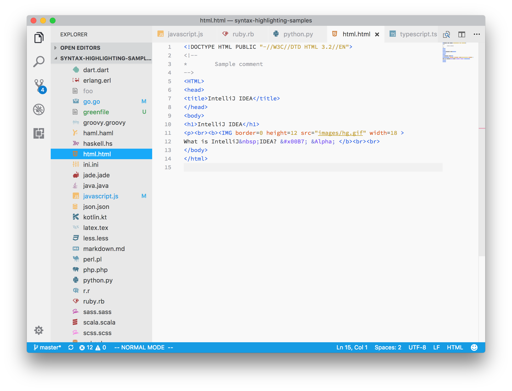
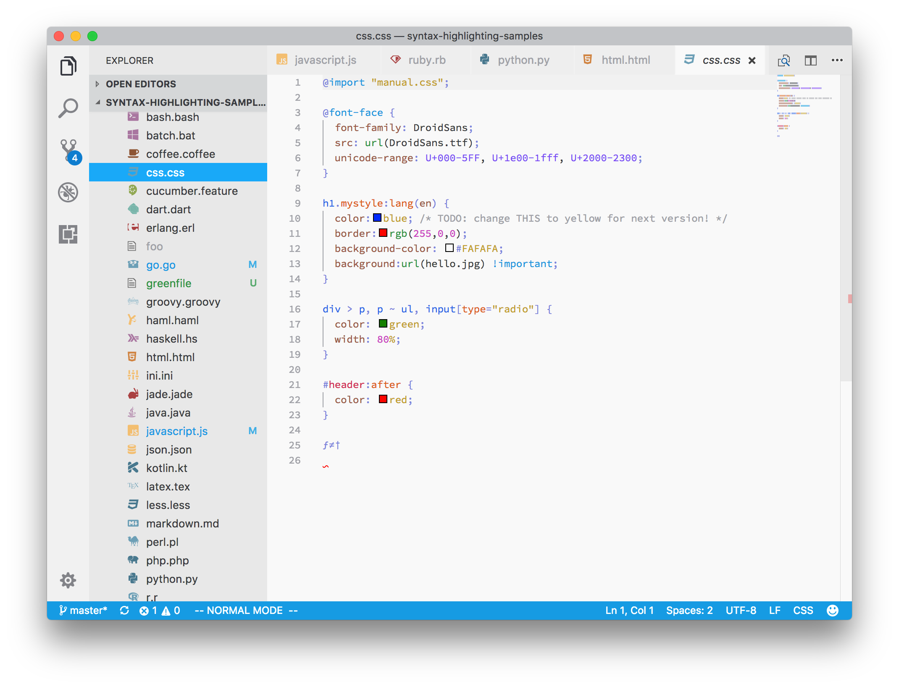

# Bluloco Light Theme

### Description

A fancy but yet sophisticated light designer color scheme / theme for
Visual Studio Code.

This theme features a much more comprehensive usage of syntax scopes and color
consistency, with due regards to aesthetics, contrast and readability.
Originally forked from the beautiful One Light Theme, enhanced with the
meaningful intuitive Bluloco color palette.

This theme also works very good when Apple's **Nightshift Mode** is activated.

Give it a try :)

## Syntax Palette

| Scope                | Color                                              | HEX     | RGB                |
| -------------------- | -------------------------------------------------- | ------- | ------------------ |
| Background           |  | #f9f9f9 | rgb(249, 249, 249) |
| Foreground           |  | #383a42 | rgb(56, 58, 66)    |
| Comment              |  | #a0a1a7 | rgb(160, 161, 167) |
| Keyword              |  | #0098dd | rgb(0, 152, 221)   |
| Function/Method      |  | #23974a | rgb(35, 151, 74)   |
| Property             |  | #a05a48 | rgb(160, 90, 72)   |
| String               |  | #c5a332 | rgb(197, 163, 50)  |
| Number               |  | #ce33c0 | rgb(206, 51, 192)  |
| Constant             |  | #823ff1 | rgb(130, 63, 241)  |
| Markup Tag           |  | #275fe4 | rgb(39, 95, 228)   |
| Markup Attribute     |  | #df631c | rgb(223, 99, 28)   |
| Class/Type/Interface |  | #d52753 | rgb(213, 39, 83)   |
| Operator/Punctuation |  | #7a82da | rgb(122, 130, 218) |

## Screenshots

Here are a bunch of screenshots. I tested a long range of languages, these are just a few.  
You can test them all in this repo:
https://github.com/uloco/syntax-highlighting-samples

